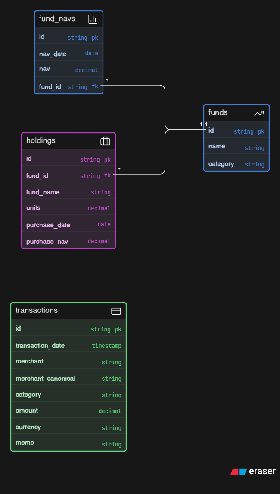

# Design Document — Tara Finance Research Agent

## Executive Summary

Tara is a finance research agent built using Mastra, PostgreSQL, Express, and OpenAI-compatible tool calling.

The system answers natural language questions about:

* Transaction history
* Spending patterns
* Merchant analysis
* Fund performance
* Portfolio valuation
* Holding returns
* Recurring subscriptions

Unlike traditional chatbot systems, Tara does not generate financial figures directly. All numerical answers are grounded in PostgreSQL data and produced through dedicated tools that execute SQL queries and deterministic calculations.

This design prioritizes:

* Accuracy
* Grounded responses
* Reproducibility
* Tool reliability
* Explainable calculations

---

# System Architecture

```text
                    ┌─────────────────┐
                    │      User       │
                    └────────┬────────┘
                             │
                             ▼
                    POST /ask Request
                             │
                             ▼
                 Express API Layer
                             │
                             ▼
                  Tara Agent (Mastra)
                             │
              Tool Selection & Reasoning
                             │
         ┌───────────────────┼───────────────────┐
         │                   │                   │
         ▼                   ▼                   ▼
 Transactions Tool     Fund Tools        Portfolio Tools
         │                   │                   │
         └───────────────────┼───────────────────┘
                             │
                             ▼
                       PostgreSQL
                             │
                             ▼
                     Grounded Response
```

---

# Request Lifecycle

1. User submits a question through `POST /ask`
2. Request is validated using Zod
3. Controller generates a request ID
4. Tara Agent receives the question
5. Agent selects one or more tools
6. Tools execute SQL queries
7. Results are returned to the agent
8. Agent generates a final response
9. Request metrics are logged
10. API returns the answer

---

# Project Structure

```text
src/
├── api/
├── controllers/
├── db/
├── eval/
├── mastra/
│   ├── agents/
│   └── tools/
├── routes/
├── tools/
├── utils/
└── validator/

scripts/
├── setup-db.ts
├── ingest.ts
└── test-tools.ts
```

---

# Agent Design

## Agent Configuration

The system uses a single Mastra agent:

```text
Tara Finance Agent
```

The agent is configured with strict operating rules:

* Every numeric answer must come from tools
* No fabricated values
* No simulated calculations
* No hidden assumptions
* Tool outputs are treated as the source of truth

### Core Instructions

The agent enforces:

* Tool-first execution
* Grounded financial analysis
* Date normalization
* Transfer exclusion
* Merchant canonicalization

This significantly reduces hallucination risk.

---

# Database Design

## transactions

Stores all financial transactions.

```sql
transactions (
  id TEXT PRIMARY KEY,
  transaction_date DATE,
  merchant TEXT,
  merchant_canonical TEXT,
  category TEXT,
  amount NUMERIC(12,2),
  currency TEXT,
  memo TEXT
)
```

### Indexes

```sql
CREATE INDEX idx_txn_date
ON transactions(transaction_date);

CREATE INDEX idx_txn_category
ON transactions(category);

CREATE INDEX idx_txn_merchant
ON transactions(merchant_canonical);
```

---

## funds

Stores fund metadata.

```sql
funds (
  id TEXT PRIMARY KEY,
  name TEXT,
  category TEXT
)
```

---

## fund_navs

Stores historical NAV data.

```sql
fund_navs (
  fund_id TEXT,
  nav_date DATE,
  nav NUMERIC(12,2)
)
```

### Index

```sql
CREATE INDEX idx_nav_fund
ON fund_navs(fund_id);
```

---

## holdings

Stores investment holdings.

```sql
holdings (
  fund_id TEXT,
  fund_name TEXT,
  units NUMERIC(12,4),
  purchase_date DATE,
  purchase_nav NUMERIC(12,2)
)
```

---

# Data Ingestion Pipeline

Dataset ingestion is performed through:

```text
scripts/ingest.ts
```

## Workflow

```text
JSON Dataset
      │
      ▼
Read Files
      │
      ▼
Normalize Merchants
      │
      ▼
Insert Transactions
      │
      ▼
Insert Funds
      │
      ▼
Insert NAV History
      │
      ▼
Insert Holdings
```

Existing data is cleared before importing a new dataset.

---

# Merchant Normalization Strategy

Transactions may contain multiple aliases for the same merchant.

Examples:

```text
SWIGGY
SWIGGY*ORDER
Swiggy Instamart
SWIGGY BANGALORE
```

During ingestion, merchants are transformed into:

```text
SWIGGY
```

and stored in:

```text
merchant_canonical
```

This enables accurate merchant-level aggregation.

---

# Tool Design

The system uses a small number of expressive tools rather than many narrowly scoped tools.

---

## Transaction Tools

### queryTransactions

Supports:

* Category filtering
* Merchant filtering
* Date filtering
* Transfer exclusion

Used for transaction lookup requests.

---

### aggregateSpend

Calculates spending totals for:

```text
Category + Date Range
```

Uses SQL aggregation.

---

### topMerchants

Ranks merchants by spend.

Returns:

* Merchant name
* Total spend

---

### totalSpend

Computes overall spending within a date range.

Transfer transactions are excluded.

---

### biggestCategory

Identifies the highest-spending category.

---

### merchantSpend

Calculates total spend for a merchant.

Supports optional date filters.

---

## Fund Tools

### fundReturn

Calculates fund performance.

Formula:

Return (%) = ((End NAV - Start NAV) / Start NAV) × 100

Used for:

* Fund analysis
* Fund comparison

---

### rankFundsByReturn

Ranks all funds by return percentage.

Returns:

* Best performing fund
* Worst performing fund
* Complete ranking

---

## Holding Tools

### holdingReturn

Calculates investment performance for a holding.

Current Value:

Units × Current NAV

Cost Basis:

Units × Purchase NAV

Return (%):

((Current Value − Cost Basis) / Cost Basis) × 100

---

### rankAllHoldings

Ranks holdings by return percentage.

---

## Portfolio Tool

### portfolioAnalysis

Aggregates all holdings.

Calculates:

* Total cost
* Portfolio value
* Profit/Loss
* Return percentage

---

## Recurring Subscription Tool

### detectRecurringSubscriptions

Identifies recurring payments using:

* Merchant frequency
* Date periodicity
* Amount similarity

Monthly recurring patterns receive higher confidence scores.

---

## Category Trend Tool

### categoryTrend

Generates monthly spending trends.

Used for:

* Spending visualization
* Historical category analysis

---

# Grounding Strategy

The model never computes financial values independently.

All financial figures originate from:

```text
SQL Queries
+
TypeScript Calculations
```

The language model is responsible only for:

* Tool selection
* Question interpretation
* Response formatting

The model is not responsible for:

* Arithmetic
* Ranking
* Aggregation
* Financial calculations

This separation significantly improves reliability.

---

# Date Interpretation Strategy

The agent converts natural language dates into explicit ranges before tool execution.

Examples:

```text
March 2025
→ 2025-03-01 to 2025-03-31

Q1 2025
→ 2025-01-01 to 2025-03-31

Jan to Mar 2025
→ 2025-01-01 to 2025-03-31

Last Year
→ Previous calendar year
```

Tools always receive normalized dates.

---

# Transfer Handling

Transactions with category:

```text
transfer
```

are excluded from spending calculations.

This prevents internal money movement from being counted as expenses.

---

# Refund Handling

Refunds are represented as negative transaction amounts.

Example:

```text
Purchase   +1000
Refund     -200
Net Spend   800
```

The SQL aggregation automatically incorporates refunds.

---

# No Data Handling

When matching records are unavailable:

```text
No data found in database
```

The system never fabricates values.

---

# Observability

Every request records:

* Request ID
* Question
* Latency
* Status
* Error information

This enables:

* Debugging
* Performance monitoring
* Failure reproduction

---

# Evaluation Methodology

Evaluation is implemented through:

```text
src/eval/eval.ts
```

The suite sends real HTTP requests to:

```text
POST /ask
```

and validates whether valid answers are returned.

Coverage includes:

* Spending analysis
* Merchant queries
* Date filtering
* Portfolio valuation
* Fund returns
* Holding returns
* Recurring subscriptions

---

# Design Trade-offs

## Advantages

* Strong grounding
* Simple architecture
* Easy debugging
* Deterministic calculations
* Low hallucination risk

## Limitations

* Sequential SQL execution for some ranking operations
* Rule-based merchant normalization
* Basic recurring-payment detection
* No caching layer
* Single-agent architecture

---

# Future Improvements

## Performance

* Query optimization
* Batch NAV retrieval
* Redis caching

## Agent Capabilities

* Multi-step financial planning
* Portfolio recommendations
* Comparative investment analysis

## Infrastructure

* BullMQ background jobs
* Streaming responses
* Metrics dashboard
* Distributed tracing

## Analytics

* Portfolio allocation analysis
* Risk scoring
* Historical performance visualization
* Fund benchmarking

```

```
## Database Design

